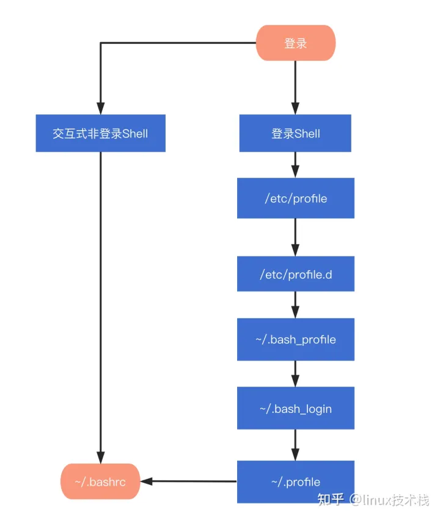

https://pypi.tuna.tsinghua.edu.cn/simple


1.  查看文件内容
    1.  cat {file} — 查看全部
    2.  cat -n {file} — 输出行号查看全部
    3.  more {file} — 只可向下翻页查看全部，q退出查看后终端还是有文件内容
    4.  less {file} — 可上下翻页查看全部，q退出查看后终端不会显示文件内容
2.  解压 tar
    1.  tar -xvf {file} — 解压文件到当前目录
    2.  tar -xvf {file} -C {dir} — 解压文件到{dir}目录
3. zip 压缩
	1. zip -r file.zip dir/
	2. 跳过某个目录 -x '' （引号必须有，引号内部写相对目录位置）
4.  统计文件数量
    1.  wc -l — 列出行数
        1.  统计文件夹中**文件**的个数：ls -l | grep "^-" | wc -l
        2.  统计文件夹中**文件夹**的个数：ls -l | grep "^d" | wc -l
        3. 统计特定后缀的文件个数：find . -type f -name "星.txt" | wc -l
    2.  wc -w — 列出英文单词数
    3.  wc -m — 列出字符数
5.  磁盘相关
    1.  查看当前文件夹下的所有文件大小：du -sh *
    2. 查看磁盘占用：df -h
6.  查看cpu、gpu占用率等情况：
    1.  nvidia-smi — gpu占用率
    2.  top — cpu 使用情况
        -   %us：表示用户空间程序的cpu使用率（没有通过nice调度）
        -   %sy：表示系统空间的cpu使用率，主要是内核程序。
        -   %ni：表示用户空间且通过nice调度过的程序的cpu使用率。
        -   %id：空闲cpu
        -   %wa：cpu运行时在等待io的时间
        -   %hi：cpu处理硬中断的数量
        -   %si：cpu处理软中断的数量
        -   %st：被虚拟机偷走的cpu
7.  文件传输
    1.  Linux2Win：scp -P 10022 [guoyinlin@10.115.110.54](mailto:guoyinlin@10.115.110.54):/home2/guoyinlin/path/filename path/filename
    2.  Win2Linux：scp -P 4001 /path/filename guoyinlin@10.13.71.37:/home3/guoyinlin/
    3. linux 互传：scp -r -P 10022  /home/guoyinlin/test.txt guoyinlin@10.13.71.37:/home/destination（-r 表示传输文件夹）
8.  ls 命令：
    1.  ls -a 查看隐藏文件
    2. ls -l 查看详细信息
    3. ls -h 显示人类可读的大小
9. 文件复制：
	1. cp -i 用于防止覆盖（不加的话会直接覆盖已有文件）
	2. cp -r 用于复制目录
10. 文件（夹）移动或重命名
	1. mv -i 用于防止覆盖
11. 文件删除：
	1. rm -i 用于再次确认
	2. rm -r 用于删除目录，推荐使用 rm -i -r 每次都检查目录文件
12. 查看文件的前/后 10 行：
	1. head/tail -n 10 file.txt
13. ps 进程管理
	1. ps -ef 详细列出所有的进程
14. 数据搜索
	1. 在文件中查找关键词（输出关键词所在的行）：grep key_word file，同时 key_word 可以是正则表达式
15. 修改 dns：sudo vim /etc/hosts；刷新 sudo /etc/init.d/network-manager restart
16. 重启网络：service networking restart
17. 解决 gitee 无法使用 ssh 连接：
	1. 设置 网卡的 mtu 为 1200（一般默认都是 1500）
	2. 重启网络
18. linux 审计系统查看：sudo tail -f /var/log/audit/audit.log
	1. 高级审计：ausearch
19. 挂载和卸载：
	1. 挂载：mount 分区 路径
	2. 卸载：unmount 分区/路径
20. nvidia 驱动 runfile 卸载和安装：
	1. 卸载：cd /usr/local/cuda-xx.x/bin，然后 sudo ./cuda-uninstaller
	2. 安装：下载对应的 runfile 文件（https://developer.nvidia.com/cuda-12-2-0-download-archive），sudo sh cuda_xxxx_linux.run
21. vscode 代理下，服务器登录和文件传输（以 4001 为例）：
	1. ssh 登录：ssh -o "ProxyCommand=nc -X connect -x 127.0.0.1:1081 %h %p" guoyinlin@10.13.71.37 -p 4001
	2. scp 传输：scp -o "ProxyCommand=nc -X connect -x 127.0.0.1:1081 %h %p" -P 4001 /path/to/local/file guoyinlin@10.13.71.37:/path/to/remote/directory
22. 深度查看 cpu 占用情况：sudo sysdig -c topprocs_cpu


### bash 中的测试命令
```bash
test condition
```
因为 bash 中的 if 不会判断条件是否成立，而是执行条件对应的命令，如果条件执行成功，则 if 成立。

而 test 命令可以将条件转成真假，此时就和常见的编程语言中的 if 差不多了。

test 中的
数值比较：![[Pasted image 20230417114957.png]]
字符串比较：![[Pasted image 20230417115046.png]]
文件比较：![[Pasted image 20230417115755.png]]
> 注意，判读字符串变量的时候，要加 "${val}" 双引号！！ 

此外，还可以使用 ```[ condition ]``` 来实现（注意方括号之间一定要有空格）。

### linux 种 # profile、bashrc、bash_profile 的区别

+ profile：位于 **/etc/profile**，用于设置系统级的环境变量和启动程序，在这个文件下配置会对**所有用户**生效，当用户登录（login）时，文件会被执行，并从 `/etc/profile.d` 目录的配置文件中查找shell设置。
+ bashrc：用于配置函数或别名：
	+ 系统级的位于 `/etc/bashrc`，对所有用户生效。
	+ 用户级的位于 `~/.bashrc`，仅对当前用户生效
	+ bashrc 文件只会对指定的 shell 类型起作用，bashrc 只会被 bash shell 调用
+ bash_profile：只对单一用户有效，文件存储位于`**~/.bash_profile**`，该文件是一个用户级的设置，可以理解为某一个用户的 profile 目录下，这个文件同样也可以用于配置环境变量和启动程序，但只针对单个用户有效。和 profile 文件类似，bash_profile 也会在用户登录（login）时生效，也可以用于设置环境变理。但与 profile 不同，bash_profile 只会对当前用户生效。

这三种文件类型的差异用一句话表述就是：

`/etc/profile`，`/etc/bashrc` 是系统全局环境变量设定；

`~/.profile`，`~/.bashrc` 用户目录下的私有环境变量设定。
三个文件的执行情况如下：



服务器硬盘和目录映射：
217 服务器：
home5 : /dev/sdb1
home2 : /dev/sdc1
218 服务器：
/dev/sdg1 /home6
/dev/sdc1 /home3

linux 源：
+ 系统的软件源位于 /etc/apt/sources.list 的文件中，所以如果需要新加系统软件源可以直接 vim 编辑这个文件
+ 其他自己加的软件源位于 /etc/apt/sources.list.d/ 的文件夹下

临时使用系统代理：
- export http_proxy=http://127.0.0.1:20171
- export https_proxy=http://127.0.0.1:7890

pip 安装包：

1. 从 github 安装：
	1. 先下载源文件，git clone 地址，然后cd进入到目录下：
		1. python setup.py install 使用 Python 的 `setuptools` 模块来安装包，执行该目录下的 `setup.py` 脚本，根据 `setup.py` 中的配置信息，将包安装到 Python 解释器的默认路径中，使得你可以在任何地方导入该包的模块
		2. pip install .：安装后的模块freeze在pip/conda依赖下，换句话说，再修改本地的原项目文件，不会导致对应模块发生变化
		3. pip install -e .：-e 理解为 editable，修改本地文件，调用的模块以最新文件为准
	2. 不下载源文件，pip install git+地址
2. 安装 wheel 文件：
	1. pip install xxx.whl